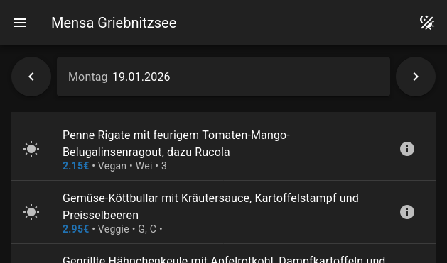

# Mensa Web App

A more lightweight web app for viewing the menus offered by the webspeiseplan-api server, now with multi-language support.



## Configuration

You can configure the API server to use a specific API server using the `public/config.js` file.


## Generating Types

The types for the API are automatically generated using

```bash
npx swagger-typescript-api generate --path "http://localhost:3000/openapi.json"
```

Please replace the URL with your server and place the generated file at `src/api/Api.ts`.

## Building

This is a normal nodeJS project that uses npm as its package manager. Thus, it's a matter of `npm i`, `npm run dev` for debugging and `npm run build` for building the final version.
